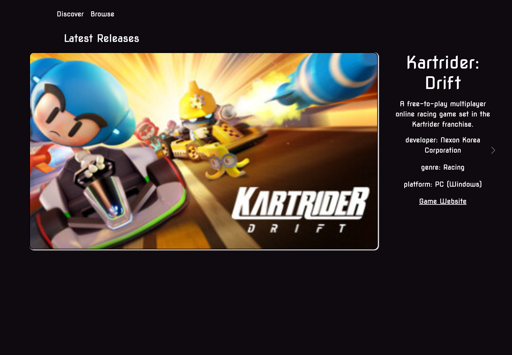
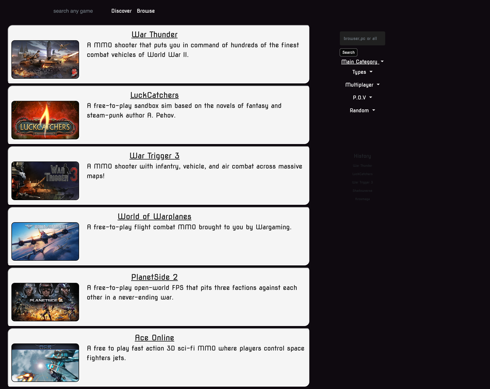

# Find-Videogame-Project

### by group-1 of UofM MERN-BootCamp 2023

## [Find-Videogame-Prjct-site](https://eshushango.github.io/find-videogame-project/)

## Description

Find your next favorite video game on any platform with our free, multi-platform app. Discover new free games all in one convenient location

## Task

Create our own app and meet project requirements !

## What we learned

- It's okay to get "help"
- Learning takes time
- How to Push, Pull and commit with GitHub via cml/terminal with more efficient
- with teamwork we go farther

## RoadMap

- Code could be updated to be more efficient
- UI could be more responsive
- added features

## Sources

[https://www.freetogame.com/](https://www.freetogame.com/)

[https://getbootstrap.com/docs/4.0/getting-started/introduction/](https://getbootstrap.com/docs/4.0/getting-started/introduction/)

[https://store.epicgames.com/en-US/](https://store.epicgames.com/en-US/)

## Team

- [https://github.com/AlexGriffitts](https://github.com/AlexGriffitts)

- [https://github.com/lonHeligas](https://github.com/lonHeligas)

- [https://github.com/graysonwagner](https://github.com/graysonwagner)

- [https://github.com/Kenny4297](https://github.com/Kenny4297)

- [https://github.com/EshuShango](https://github.com/EshuShango)
